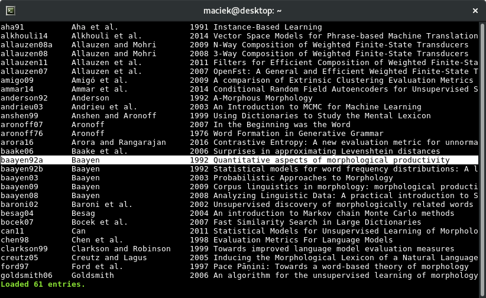

# About

Bibman (BIBliography MANager) is a small console tool for managing BibTeX
files. Its functionality is meant to be similar to JabRef and its user
interface is inspired by Vim. It enables quick searching, filtering, editing,
sorting etc. of bibliography entries using a text-mode, keyboard-only
interface. It stores bibliographies in plain BibTeX files and uses only
standard fields.

# Dependencies

`perl` >= 5.24\*, `ncurses` >= 6.0\*, `perl-Curses`, `perl-Text-Bibtex`

\*) might work on earlier versions, but not tested

# Installation

```
perl Makefile.PL
make
make install
```

# Getting started

After installation, run the command `bibman MY-BIBLIOGRAPHY-FILE` to open the
bibliography file. You will see a list of entries like this:



Here are some basic keybindings:

* **k** move one entry up,
* **j** move one entry down,
* **g** move to the beginning of the list,
* **G** move to the end of the list,
* **o** open the pdf file if present; the file must be placed in the same
	directory as the bibliography file and named `KEY.pdf`, where `KEY` is
	the entry key; by default it runs `xdg-open`, you can override this by
	setting the environment variable `READER`
* **a** add a new entry,
* **e** edit the current entry,
* **u** undo the last operation,
* **s**:save the current file,
* **:** show the command line,
* **q** quit application.

On the edit screen, use the arrow keys or **k**/**j** to navigate up and down
the form, **Enter** to toggle editing a field and **q** to exit the edit
screen.

See the manual page (`man bibman`) for a complete list of keybindings and
commands.

# Disclaimer

The software is in alpha stage and might be unstable. Please backup all
bibliography files you're working with.

# Author

Maciej Janicki <macjan@o2.pl>, 2017-2020

Feel free to contact me if you have any requests for features or other
suggestions.
